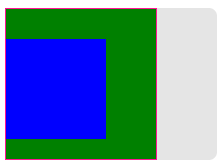

# 前端面试全家桶

## 1、HTML、CSS部分

### 1.1、如何理解HTML语义化？


**所谓的HTML语义化就是在合适的位置放置正确的代码**

**优点：**

* 1、**增加代码的可读性**；可以让其他开发者一目了然的知道看的代码在页面上的位置及作用
* 2、**利于搜索引擎的读取（SEO）;** 网络爬虫是搜索引擎用来抓取网页内容的重要工具。当网页使用语义化的HTML编写时，网络爬虫可以更容易地解析出页面的结构和内容，从而更准确地抓取和索引网页信息。
* 3、**有助于屏幕阅读器的阅读；** 有些网页带有屏幕阅读器，在阅读文章的时候，有时候会根据标签内容来调整读音（如strong、b标签会重读音）
* 4、**在css资源加载失败时也会显示出基本的样式结构；**

### 1.2、默认情况下，哪些HTML标签是块级元素、哪些是内联元素?

| 特征           | 行内元素                                                    | 块级元素                                                | 行内块元素                                                   |
| -------------- | ----------------------------------------------------------- | ------------------------------------------------------- | ------------------------------------------------------------ |
| 排列方式       | 在一行内水平排列                                            | 独占一行或多行                                          | 在一行内水平排列，但保持块级特性                             |
| 宽度和高度     | 无法直接设置宽度和高度（但可以设置`line-height`来影响行高） | 可以设置宽度和高度                                      | 可以自由设置宽度和高度                                       |
| 内边距和外边距 | 垂直方向的`padding`和`margin`无效                           | 四个方向的`padding`和`margin`都有效                     | 四个方向的`padding`和`margin`都有效                          |
| 容纳元素       | 只能容纳文本或其他行内元素                                  | 可以容纳块级元素和行内元素                              | 主要容纳文本或其他行内元素，但也可以包含块级元素（在某些情况下） |
| 示例标签       | `<span>`, `<a>`,  `<label>`, `<em>`, `<strong>`等           | `<div>`, `<p>`, `<h1>`-`<h6 `<label>`（在某些情况下）等 | `img`、`input`、`textarea`、`button`                         |
| 转换方式       | 使用`display: inline;`                                      | 使用`display: block;`                                   | 使用`display: inline-block;`                                 |

请注意，这些区别是基于HTML和CSS的默认行为，但在某些情况下，通过CSS样式，你可以改变元素的默认行为。例如，你可以使用`display: inline-block;`来使一个块级元素在同一行内显示，同时保持其块级特性（如设置宽度和高度）。

### 1.3、CSS中的盒模型？

**CSS盒模型**:

*  是CSS布局的基础，它决定了元素如何在页面上渲染其大小和位置。
* 由 内容content、内边距（padding）、边框（border）和外边距（margin）组成的矩形盒子。


**盒模型的分类**

* **W3C盒子模型（标准盒模型）：**width和height指的是内容区域的宽度和高度

即：在标准模式下，元素总宽度 = 内容的width + padding(左右) + border(左右) + margin(左右)

* **IE盒子模型（怪异盒模型）：**width和height指的是  内容区域 + 边框+内边距


**如何在CSS中设置盒模型**

在不设置的情况下，默认为W3C盒模型（标准盒模型）。

标准盒模型：`box-sizing: content-box;`

IE模型：`box-sizing: border-box;`

### 1.4、margin纵向重叠的问题

```html	
<!-- 以下AAA和BBB之间的距离是多少 -->
<style>
    p {
        font-size: 16px;
        line-height: 1;
        margin-top: 10px;
        margin-bottom: 15px;
    }
</style>
<div>
    <p>AAA</p>
    <p></p>
    <p></p>
    <p></p>
    <p>BBB</p>
</div>
```

**答案： 15px**

> ​	解析：
>
> * 相邻元素的`margin-top`和`margin-bottom`会发生重叠
> * 空白内容的`<p></p>` 也会重叠 


当给空白元素`margin-bottom`设置`100px`; 实际合并后`AAA` -> `BBB`之间距离为`100px`


```html
<div>
    <p>AAA</p>
    <p></p>
    <p></p>
    <p>BBB</p>
    <p></p>
    <p>BBB</p>
</div>
```


**margin负值的问题：**

* `margin-top` 和`margin-left`负值，元素向上、向左移动
* `margin-right`负值，右侧元素左移，自身不受影响
* `margin-bottom`负值，下方元素上移，自身不受影响


### 1.5、BFC的理解和应用

`Block format context`，块级格式化上下文，可以看做一个独立的隔离容器

**特点：**

* 1、bfc内部元素不会影响到外界、同样外业元素也不会影响到内部元素
  * 利用此功能可以解决相邻两个元素外边距合并为问题
  * 也可以解决父子元素外边距塌陷的问题
* 2、bfc内部的相邻两个元素外边距会发生合并
* 3、bfc元素不会与float浮动元素重叠
  * 也可以实现文字环绕盒子的效果
* 4、计算BFC的高度时，浮动子元素也参与计算
  * 利用此特点可以实现清除浮动的效果

> 每个BFC区域只包含其子盒子，不包含其孙子盒子

**如何让一个常规盒子变为BFC盒子**

* 1、html根元素

* 2、浮动元素：float除none以外的值

* 3、绝对定位元素：position(absolute、fixed)

* 4、display为inline-block、table-cells、flex 、flow-root 

* 5、overflow除了visible 以外的值(hidden、auto、scroll)

> 常用：overflow:hidden，display: flow-root因为他没有副作用


**测试**

```html
<section>
		<style type="text/css">
			.parent {
				width: 150px;
				height: 150px;
				background-color: green;
			}
			.child {
				width: 100px;
				height: 100px;
				background-color: blue;
				margin-top: 30px;
			}
		</style>
		<div>
			<div class="parent">
				<div class="child"></div>
			</div>
		</div>
	</section>
```


给父元素设置`bfc` （bfc内部元素不会影响到外界、同样外业元素也不会影响到内部元素）

```css
.bfc {
    border: 1px solid deeppink;
    display: flow-root;
}
```



> 其余解决办法： 给父元素设置`border`


**测试：bfc元素不会与float浮动元素重叠**

```html
<section>
		<style type="text/css">
			.float {
				width: 150px;
				height: 150px;
				background-color: red;
				float: left;
			}
			.box {
				width: 300px;
				height: 300px;
				background-color: blue;
			}
			
		</style>
		<div>
			<div class="float">
				
			</div>
			<div class="box">
				
			</div>
		</div>
	</section>
```


给`box`元素添加`bfc`类

```html
<div>
    <div class="float">

    </div>
    <div class="box bfc">

    </div>
</div>
```


**测试： 计算BFC的高度时，浮动子元素也参与计算**

```html
<section>
		<style type="text/css">
			.parent1 {
				border: 1px solid #000;
			}
			.float {
				width: 150px;
				height: 150px;
				background-color: red;
				float: left;
			}
			
			
		</style>
		<div class="parent1">
			<div class="float"></div>
		</div>
	</section>	
```


给父元素触发`bfc`时

```html
<div class="parent1 bfc">
    <div class="float"></div>
</div>
```


### 1.6、float布局的问题、以及clearfix

**清除浮动的几种方式：**

* 1、伪元素清除

  ```css
  .clearfix::after {
      content: '';
      display: table;
      clear:both;
  }
  
  /* 或者 */
  .clearfix{
  　　zoom:1;为了兼容IE
  }
  clearfix:after{
      content:"";//设置内容为空
      height:0;//高度为0
      line-height:0;//行高为0
      display:block;//将文本转为块级元素
      visibility:hidden;//将元素隐藏
      clear:both//清除浮动
  }
  ```

* 2、触发`bfc`

  ```css
  .clearfix {
      overflow: hidden;
  }
  ```

* 3、使用额外标签法

  ```css
  .clear{
  　　clear:both;
  }
  ```

  　在浮动的盒子之下再放一个标签，在这个标签中使用clear:both，来清除浮动对页面的影响.

  ​					a.内部标签：会将这个浮动盒子的父盒子高度重新撑开.

  　　　　　　b.外部标签：会将这个浮动盒子的影响清除，但是不会撑开父盒子.

  > 注意：一般情况下不会使用这一种方式来清除浮动。因为这种清除浮动的方式会增加页面的标签，造成结构的混乱.

* **为父元素设置高度**

  直接给父元素设置高度

  

**圣杯布局** 和 **双飞翼布局** 目的

* 三栏布局，中间一栏最先加载和渲染(内容最重要)
* 两侧内容固定，中间内容随着宽度自适应
* 一般用于 PC 网页


### 1.7、flex画骰子


### 1.8、css定位、absolute 和relative分别依据什么定位?

**absolute 和relative分别依据什么定位**

* `relative` 依据自身定位
* `absolute` 依据最近一层的定位元素定位
  * 定位元素包括  含有`relative` 、`absolute` 、`fixed`的元素，如果都找不到则使用`body`元素

### 1.9、居中对齐有哪些实现方式?

**居中对齐的几种方式**

* 水平居中
  * inline元素： text-align: center
  * block元素： margin: 0 auto
  * absolute元素： left:50%; margin-left: 负值；或者transform: translateX(-50%)
  * dispaly: flex; justify-content: center;
* 垂直居中
  * inline元素：line-height的值等于height;
  * absolute元素： top:50%; margin-top: 负值；或者transform: translateY(-50%)
  * absolute元素： left、top、right、bottom = 0 ; margin: auto;
  * dispaly: flex; align-items: center; 
  * flex + margin:  父元素display: flex;， 子元素margin: auto;

​	

**测试**

*  left、top、right、bottom = 0 ; margin: auto;

```html
<section>
		<style type="text/css">
			.parent3 {
				width: 300px;
				height: 180px;
				background-color: #f5f7fa;
				position: relative;
			}
			.child3 {
				width: 100px;
				height: 100px;
				background-color: deeppink;
				position: absolute;
				inset: 0;
				margin:auto;
			}
		</style>
		<h5></h5>
		<div class="parent3">
			<div class="child3"></div>
		
		</div>
	</section>	
```


* flex + margin:  父元素display: flex;， 子元素margin: auto;

```html
<section>
    <style type="text/css">
        .parent4 {
            width: 300px;
            height: 180px;
            background-color: #f5f7fa;
            display: flex;
        }
        .child4 {
            width: 100px;
            height: 100px;
            background-color: deeppink;
            margin: auto;
        }
    </style>
    <h5></h5>
    <div class="parent4">
        <div class="child4"></div>

    </div>
</section>
```


### 1.10、line-height的继承问题


```css
body {
    font-size: 20px
    line-height: 30px
}
p {
    font-size: 16px;
}
```

> 上面 p标签行高 为 30px


```css
body {
    font-size: 20px;
    line-height: 2;
}
p {
    font-size: 16px;
}
```

> 上面 p标签行高 为  32px  (16px * 2)


```css
body {
    font-size: 20px;
    line-height: 200%;
}
p {
    font-size: 16px;
}
```

> 上面 p标签行高 为 40px

### 1.11、响应式

css中像素尺寸单位

* px:  绝对长度单位
* em: 相对长度单位， 相对于父元素的font-size
* rem: 相对长度单位， 相对于html根元素的font-size
* %: 相对于父元素的特定属性的值进行计算。例如，width: 50% 表示元素宽度为父元素宽度的50%
* vw ：相对于网页视窗宽度的百分比单位。1vw 等于视窗宽度的1%
*  vh：相对于网页视窗高度的百分比单位。1vh 等于视窗高度的1%。
* vmin：相对于视窗宽度和高度中较小值的百分比单位。
*  vmax：相对于视窗宽度和高度中较大值的百分比单位。

1.12、如何实现响应式

1.13、css动画相关


>  上图的 100vw = 553px

## 2、JS基础部分

**2.1、typeof能判断哪些类型？**

`typeof`是JavaScript中最基本的类型检测手段，它可以准确判断出除`null`以外的所有原始类型，但对于引用类型则显得力不从心——除了`function`，它会将所有其他引用类型（数组、对象等）一概报告为`'object'`。

```js
//基本类型
let str='Hello'
let num=123
let flag=false
let un=undefined
let nu=null

console.log(typeof(str))//string
console.log(typeof(num))//number
console.log(typeof(flag))//boolean
console.log(typeof(un))//undefined
console.log(typeof(nu))//object

//引用类型
let obj={}
let arr=[]
let fn=function(){}
let date=new Date()

console.log(typeof(obj))//object
console.log(typeof(arr))//object
console.log(typeof(fn))//function
console.log(typeof(date))//object

```

> typeof的判断原理是：将值转换为二进制后，看其前三位是不是0，所有的引用类型（除了`function`）的二进制前三位都是0，null的二进制全部是0。因此，在需要区分具体引用类型时，`typeof`并不是最佳选择。

### 2.2、类型转换？

**类型转换分为两种：**

* 显式类型转换；

  * 显式类型转换是通过编写代码来明确告诉 JavaScript 进行类型转换的过程。以下是一些常见的显式类型转换的方法：
  * **parseInt() 和 parseFloat()**用于将字符串转换为整数或浮点数。
  * **String()**：将其他数据类型转换为字符串。
  * **Number()**：将其他数据类型转换为数字。
  * **Boolean()**：将其他数据类型转换为布尔值。
  * 等

* 隐式类型转换（强制类型转换）

  * 当运算符在运算时，若两端`数据类型不统一`，编译器会帮我们`自动转换`成`相同类型`的数据，这就是隐式转换。； 通常在以下情况进行转换：

  * **if 语句判断**

    * ```js
      if ('你好' ) {
          console.log('打印内容')
      }
      ```

  * `==` **比较操作符**

    * ```js
      console.log('42' === 42) // 隐式将 str 转换为数字，然后比较
      ```

  * **数学运算** / **字符串拼接**

    * ```js
      let a = 10 + '10' // 1010
      let b = true + '10' 'true10'
      let c = 10 + true // 11
      
      console.log(null == undefined) // true (这种可以应用在，obj.a == null; 这种情况 null和undefined都为true)
      console.log(null == '') //false
      console.log(undefined == '') // false
      console.log(0 == '') //true
      console.log(false == '') // true
      ```

#### 隐式转换规则

隐式转换是一步一步完成的，如果比较或运算的过程中数据类型仍不一致，最终会将两边数据都转成Number类型再进行运算。


> 经测试，`null` 和 `undefined`不支持上面隐式转换的规则

Object => String => Number

 Boolean => Number

 undefined/null => Number

#### 测试用例

##### **拼接字符串**

* 1、非字符串数据先调用String()转成字符串 再进行拼接

  ```js
  // Number + String
  console.log(1+"测试") // "1测试"
  
  // Boolean + String
  console.log(true+"测试") // "true测试"
  
  // null + String
  console.log(null+"1") // null1
  
  // undefined + String
  console.log(undefined+"1") // undefined1
  
  // Array + String
  console.log([1,2,3]+"测试") // 1,2,3测试
  
  // Object + String
  console.log({name:"田本初"}+"测试") // [object Object]测试
  
  // Function + String
  const fn = () => {
      console.log("111")
  }
  console.log(fn+"测试")
  // () => {
  //    console.log("111")
  // }测试
  
  ```

##### **算术运算符**

* 非Number数据先调用Number()转成数字 再进行运算

  Boolean中true为1，false为0

  Null强制转换后为0

  ```js
  //Boolean + Number
  console.log(1 + true) // 2
  console.log(1 + false) // 1
  
  
  //Null + Number
  console.log(1 + null) // 1
  
  
  //Undefined + Number
  console.log(1 + undefined) // NaN
  ```

##### **==运算符**

**==两边均为引用数据类型时**

返回`false`，因为引用数据类型比较的是`地址`

```js
console.log([] == []) // false
console.log([] == {}) // false
console.log({} == {}) // false
const fn = () => {
    console.log("111")
}
console.log(fn == []) // false
console.log(fn == {}) // false
```

**引用类型比较**

只有`长度小于1`的`数组`才`有可能`转为Number,长度0（空数组） => “” => 0,[1] => “1” => 1

而Function与Object最终不会转成纯Number只能为NaN

* 与Boolean比较

  * 根据`隐式转换规则` Object => String => Number Boolean => Number 二者根据Number进行比较

  * ```js
    // [] => "" => 0
    // true => 1
    // 故为false
    console.log([] == true) // false
    
    ```

* 与String比较

  * Object => String 此时与字符串类型一致 不必继续将二者转为Number 就可直接比较

  * ```js
    // [1,2] => "1,2"
    console.log([1,2] == "1,2") // true
    ```

* 与Number比较

  * Object => String => Number 需注意：数组长度只要大于1，最终结果就为NaN
    
  * ```js
    // [1] => "1" => 1
    console.log([1] == 1) // true
    
    // [] => "" => 0
    console.log([] == 0) // true
    
    // 需注意 [1,2] => "1,2" => NaN  而不是12
    console.log([1,2] == 12) // false
    
    ```

#### == 和 === 的区别

```
===` 严格相等，会比较两个`值的类型和值
==` 抽象相等，比较时，会`先进行类型转换，然后再比较值
```

### 2.3、值类型和引用类型的区别？

**基本数据类型赋值方式**


​	**引用类型赋值方式**


**值类型有哪些？**

`string`   `number`  `boolean` `undefined` `symbol` `bigint` `null`

**引用类型有哪些？**

`object`  `array`  `function`


**他们之间的区别？**

* 存储位置不同

  * 值类型存储在栈中
  * 引用类型存储在堆中 （为什么要存储在堆中？ 1、地址赋值比较快、2、引用类型大小不固定）

* 赋值方式不同

  * 值类型赋值为值拷贝
  * 引用类型赋值为对象地址赋值
* 比较方式不同
  *  值类型是对比值是否相同
  *  引用类型对比的是地址是否相同

  


### 2.4、手写深拷贝

**浅拷贝：** 有两种方式，一种是把一个对象里面的所有的属性值和方法都复制给另一个对象，另一种是直接把一个对象赋给另一个对象，使得两个都指向同一个对象。

**深拷贝：** 把一个对象的属性和方法一个个找出来，在另一个对象中开辟对应的空间，一个个存储到另一个对象中。

> 两者就在于，浅拷贝只是简单的复制，对对象里面的对象属性和数组属性只是复制了地址，并没有创建新的相同对象或者数组。而深拷贝是完完全全的复制一份，空间大小占用一样但是位置不同！！

**浅拷贝示例**

```js
//浅拷贝:拷贝就是复制,就相当于把一个对象中的所有的内容,复制一份给另一个对象,
        //直接复制,或者说,就是把一个对象的地址给了另一个对象,他们指向相同,两个对象之间有共同的属性或者方法,都可以使用
  
        // 第一种：
        var obj1 = {
            age: 10,
            sex: "男",
            car: ["奔驰", "宝马", "特斯拉", "奥拓"]
        };
        //另一个对象
        var obj2 = {};
  
        //写一个函数,作用:把一个对象的属性复制到另一个对象中,浅拷贝
        //把a对象中的所有的属性复制到对象b中
        function shallowCopy(obj,targetObj){
            for (let key in obj){
                targetObj[key] = obj[key];
            }
        }
        shallowCopy(obj1, obj2);
        console.dir(obj2);//开始的时候这个对象是空对象
        console.dir(obj1);//有属性
        //change car attribute
        obj1.car.push("奥迪");
        //the car of obj2 change,too.for the point of the car in obj2 is same as the obj1
        console.log(obj2.car);
  
        // 第二种
        var obj3 = obj1;
        console.dir(obj3);
```

**深拷贝的几种方式**
* 1、递归拷贝
* 2、`JSON.parse(JSON.stringify(obj))`实现新拷贝
  * **缺陷：**
    1. NaN ==> null
    2. undefined ==> 空
    3. 时间戳 ==> 字符串时间
    4. 错误信息 ==> 空对象
    5. Infinity ==> null


**JSON实现深拷贝**

```js
var obj = {
   a:NaN,
   b: undefined,
   c:new Date(),
   d:new RegExp(/\d/),
   e:new Error(),
   f:Infinity
}
console.log(obj);
let Obj2 = JSON.parse(JSON.stringify(obj))
console.log(Obj2);

/*
{
	a: null,
	c: "2024-06-21T02:02:02.916",
	d:{},
	e:{}，
	f: null
}
*/
```


**递归实现深拷贝**


```js
function deepClone (obj) {
    // 基本数据类型直接返回
    if (typeof obj !== 'object' || obj === null) {
        return obj
    }
    if (typeof obj === 'function') {
        return obj
    }
    if (obj instanceof Date) {
        return new Date(obj)
    }
    if (obj instanceof RegExp) {
        return new RegExp(obj)
    }
    // 通过构造函数创建同类型数据
    const result = new obj.constructor()
    for (let key in obj) {
        if (obj.hasOwnProperty(key)) {
            result[key] = deepClone(obj[key])
        }
    }
    return result
}
```


> js中常见的浅拷贝： `Object.assign()`, `Array.slice()`, `...扩展符`、`遍历一层拷贝`

### 2.5、原型和原型链

```js
GrandFather.prototype.say = function () {
    console.log('haha');
}
function GrandFather() {
    this.age = 60
    this.like = 'drink'
}

Father.prototype = new GrandFather()
function Father() {
    this.age = 40
    this.fortune = {
        card: 'visa'
    }
}

Son.prototype = new Father() // {age: 40, fortune: {xxx}}
function Son() {
    this.age = 18
}

let son = new Son()
 console.log(son.age); // 18
console.log(son.fortune);
 console.log(son.like);
console.log(son.say()); 
```


构造函数、实例对象、原型对象 之间的关系？


#### 原型链


既然这个是对象类型的属性，而原型对象也是对象，那么原型对象就也有这个属性，但是原型对象的__proto__又是指向哪呢？

我们来分析一下，既然原型对象也是对象，那我们只要找到对象的构造函数就能知道__proto__的指向了。而js中，对象的构造函数就是Object()，所以对象的原型对象，就是Object.prototype。既然原型对象也是对象，那原型对象的原型对象，就也是Object.prototype。不过Object.prototype这个比较特殊，它没有上一层的原型对象，或者说是它的__proto__指向的是null。

所以上面的关系图可以拓展成下面这种：

 到这里，就可以回答前面那个问题了，如果某个对象查找属性，自己和原型对象上都没有，那就会继续往原型对象的原型对象上去找，这个例子里就是Object.prototype，这里就是查找的终点站了，在这里找不到，就没有更上一层了（null里面啥也没有），直接返回undefined。

可以看出，整个查找过程都是顺着__proto__属性，一步一步往上查找，形成了像链条一样的结构，这个结构，就是原型链。所以，原型链也叫作隐式原型链。

正是因为这个原因，我们在创建对象、数组、函数等等数据的时候，都自带一些属性和方法，这些属性和方法是在它们的原型上面保存着，所以它们自创建起就可以直接使用那些属性和方法。

#### 函数也是一种对象

函数在js中，也算是一种特殊的对象，所以，可以想到的是，函数是不是也有一个__proto__属性？答案是肯定的，既然如此，那就按上面的思路，先来找找函数对象的构造函数。

在js中，所有函数都可以看做是Function()的实例，而Person()和Object()都是函数，所以它们的构造函数就是Function()。Function()本身也是函数，所以Function()也是自己的实例，听起来既怪异又合理，但是就是这么回事。

```js
console.log(Person.constructor === Function); // true
console.log(Object.constructor === Function); // true
console.log(Function.constructor === Function); // true

```

既然知道了函数的构造函数，那么函数的__proto__指向我们也就知道了，就是Function.prototype。

```js
console.log(Person.__proto__ === Function.prototype); // true
console.log(Object.__proto__ === Function.prototype); // true
console.log(Function.__proto__ === Function.prototype); // true
```

根据这几个结论，我们就能拓展出一张更大的关系图了：


#### 手写instanceof

```js
// 手写instanceof
function myInstanceof(left, right) {
    left = left.__proto__
    while (left !== null) {
        if (left === right.prototype) {
            return true
        }
        left = left.__proto__
    }
    return false

}
console.log(myInstanceof(new Array(), Array))
```

### 2.6、作用域和闭包

#### 作用域

**作用域：** 表示变量的合法使用范围

**作用于链：** 我们访问一个变量、先在当前作用于查找；找到就使用，找不到就向上一层查找、... 这样一层一层的查找，像链一样的结构，叫做**作用域链**

>如果到全局作用域都没找到，则报错`xx is not defined`


**作用于的分类**

* 全局作用域
  * 在函数最外层声明的变量是**全局作用域**
* 函数作用域
  * 在函数内部声明的变量是**全局作用域**
* 块级作用域
  * ES6引入了两种新的声明方式：`let`和`const`，它们与`var`相比，最大的区别就是它们具有块级作用域。块级作用域是指变量在最近的`{}`代码块内有效。

#### 闭包

形成条件： 函数内部嵌套函数、内部函数访问外部函数的变量

优点：

* 1、使变量长期在内存中驻扎，避免垃圾回收机制收回
* 2、防止污染全局变量


### 2.7、var、let、const 之间的区别？

var、let、const  都可以声明变量

**不同点：**

* 变量提升： var声明的变量可以进行变量提升、let、const声明的变量不能进行变量提升
* 挂在到全局： var在全局作用于声明的变量会挂在到window/gloabl，let、const声明的变量不能挂在到全局
* 块级作用域: var声明的变量不存在块级作用域的限制， let、const声明的变量存在块级作用域的限制
* 重复声明： var声明的变量可以重复声明，let、constt声明的变量不能重复声明
* 暂时性死区: 在使用let、const命令声明变量之前，该变量都是不可用的。这在语法上，称为[暂时性死区](https://so.csdn.net/so/search?q=暂时性死区&spm=1001.2101.3001.7020)。使用var声明的变量不存在暂时性死区。（也就是let、和const不存在变量提升）
* let 和const之间的区别： let声明的变量可以重复赋值，const声明的变量不能重复赋值，且const变量要有默认值

#### var 和 函数提升

先说之前、我们说的函数其实分为两种： **函数声明** 和 **函数表达式**

```js
// 函数声明
function a {}

// 函数表达式
var a = function () {}
```

**先说结论**

- 变量的声明被提前到作用域顶部，赋值保留在原地
- 函数声明整个“被提前”
- 函数表达式时，只有变量“被提前”了，函数没有“被提前”
- ***\*函数提升优先级高于变量\****提升，且**不会被同名变量声明**覆盖，但是**会被变量赋值后覆盖**。而且存在同名函数与同名变量时，优先执行函数。

```js
下面这道题真的很有水准:
 
console.log(a);      
console.log(a()); //1
 
var a = 1;
function a(){
    console.log(1);
}
console.log(a);       //1   
a = 3
console.log(a())      //Uncaught TypeError: a is not a function
```

```js
它的过程就相当于:
 
function a (){   //变量提升到最顶部
    console.log(1)
}
 
var a; 
 
console.log(a) // 1  ***\*函数提升优先级高于变量\****提升，且**不会被同名变量声明**覆盖，但是**会被变量赋值后覆盖**。而且存在同名函数与同名变量时，优先执行函数。
console.log(a());
 
 
 
a = 1    //这里变量赋值后覆盖同名函数，a此时是变量且值为1
console.log(a) // 1
 
a = 3
console.log(a()) // 3
```

### 2.8、this指向、bind、call、apply 

this的几种情况？

手写apply

```js
Function.prototype.myApply = function (context, rest) {
    context = (context === undefined || context === null) ? window : Object(context)
    const fn = Symbol('fn')
    context[fn] = this
    const result = context[fn](...rest)
    delete context[fn]
    return result
}
```


手写call

```js
Function.prototype.myCall = function (context, ...rest) {
    context = (context === undefined || context === null) ? window : Object(context)
    const fn = Symbol('fn')
    context[fn] = this
    const result = context[fn](...rest)
    delete context[fn]
    return result
}
```


手写bind

```js
Function.prototype.myBind = function (context) {
    context = (context === undefined || context === null) ? window : Object(context)
    const fn = Symbol('fn')
    context[fn] = this
    return function (...rest) {
        const result = context[fn](...rest)
        delete context[fn]
        return result
    }
}
```

